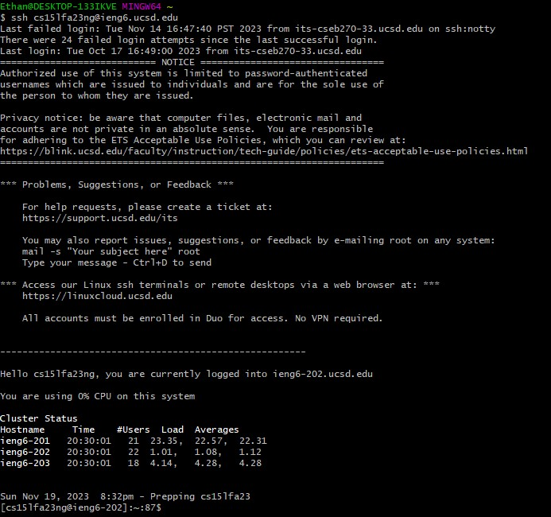

# Lab Report 4
---

Step 1: Login into ieng6
---

Once your terminal is open, type in "ssh cs15lf23XXX@ieng6.ucsd.edu" where you fill in the XXX with your personal login to initiate the login. You should automatically login thanks to your SSH key from week 3!   

Step 2:
---

