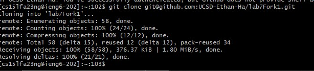
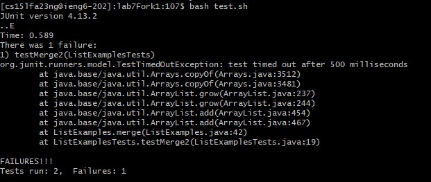
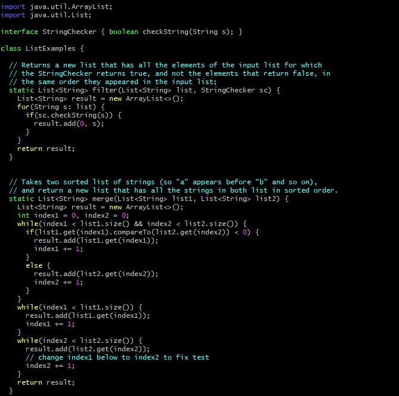
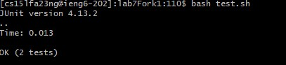

# Lab Report 4
---

Step 4: Login into ieng6
---

Once your terminal is open, type in "ssh cs15lf23XXX@ieng6.ucsd.edu" where you fill in the XXX with your personal login to initiate the login. You should automatically login thanks to your SSH key from week 3!   

Step 5: Clone the forked repository
---

Copy the SSH link from the cloned repository on your Github and paste it into "git clone (insert url)".   

Step 6: Run code (fail)
---

Type "bash t" and then press <tab> to fill in the rest-- you can press <enter>. 

Step 7: Edit code
---

Type "vim ListExamples.java" to open the code in vim. Press <j> (to go down) 43 times then <l> 12 times to get to the bugged code. Then you press <i> to be able to edit the code. <Backspace> once then replace the 1 in "index1" with a 2. Press <escape> to enter normal mode then type :wq to save and exit vim.   

Step 8: Run code (Success)
---

Type "bash t" and then press <tab> to fill in the rest-- you can press <enter>. Test should work fine now!

Step 9: Commit and push
---

Type "git add ListExamples.java" to prepare for the commit. Once added, type 'git commit -m "(insert msg here)" ' to commit with a message. Finally, type "git push" to finalize changes.
